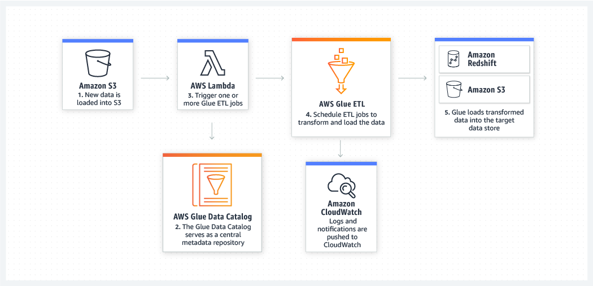
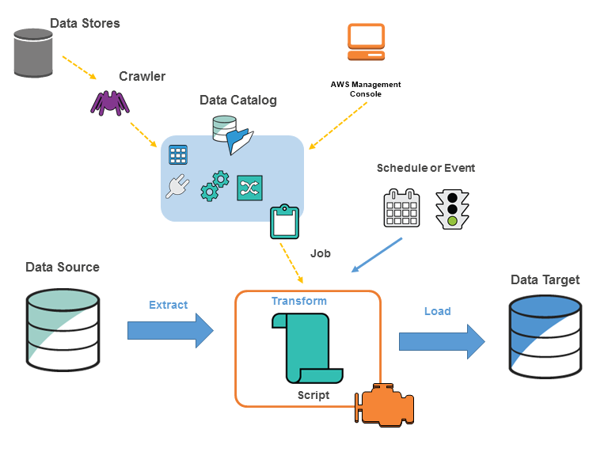
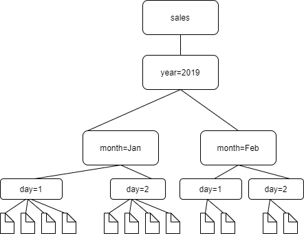

- [[AWS]] 旗下的数据集成服务
- 产品页
	- https://aws.amazon.com/glue/
- 文档页
	- https://docs.aws.amazon.com/glue/latest/dg/what-is-glue.html
- Build event-driven ETL (extract, transform, and load) pipelines
	- 
- [[AWS Athena]] 支持通过 Glue 实现到 S3 的数据集成
-
- 几个关键概念
	- 
	- Data Catalog
		- 存储 Database 和 Tabel Scehma
	- Crawler
		- 数据爬虫，从 Data Stores 中爬取数据
		- [工作方式](https://docs.aws.amazon.com/glue/latest/dg/crawler-s3-folder-table-partition.html)
			- 
			- Glue 的爬虫会把同一个目录下的所有文件当作同一个 db
			- 写数据时候可以拆分成同一个目录/前缀下的多个文件
	- Data Stores
		- 原始数据存储的地方，比如 s3
-