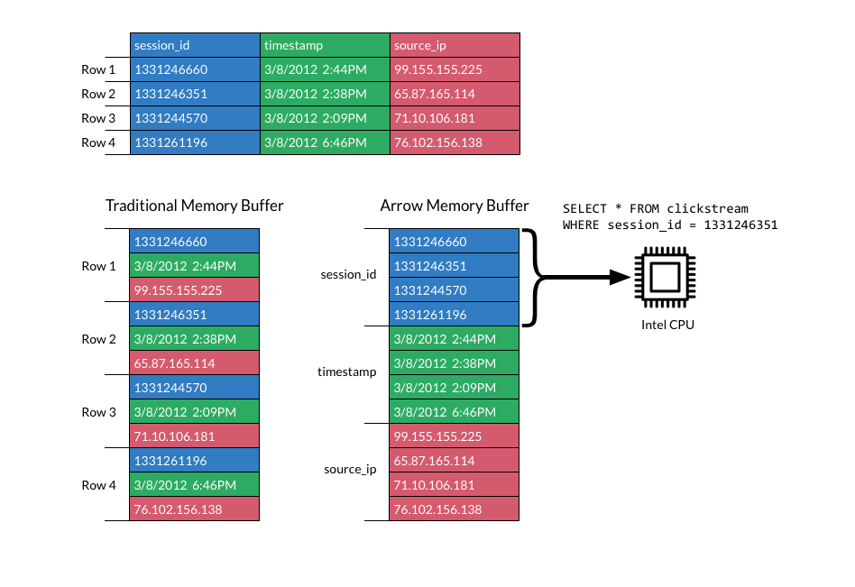
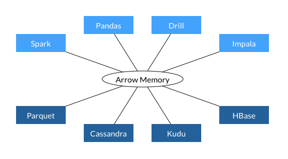

alias:: Apache Arrow

- https://arrow.apache.org/
-
- A critical component of Apache Arrow is its in-memory columnar format, a standardized, language-agnostic specification for representing structured, table-like datasets in-memory.
-
- 特点
	- Columnar is Fast
		- {:height 541, :width 776}
	- Standardization Saves
		- 
- 特性
	- 数据相邻
		- Data adjacency for sequential access (scans)
	- O(1) 随机读取
		- O(1) (constant-time) random access
	- 向量化友好
		- SIMD and vectorization-friendly
	- 零拷贝访问
		- Relocatable without “pointer swizzling”, allowing for true zero-copy access in shared memory
- 性能测试
	- [Benchmarks Tools](https://arrow.apache.org/docs/developers/benchmarks.html)
	- [Language-independent Continuous Benchmarking (CB) for Apache Arrow](https://github.com/ursacomputing/benchmarks)