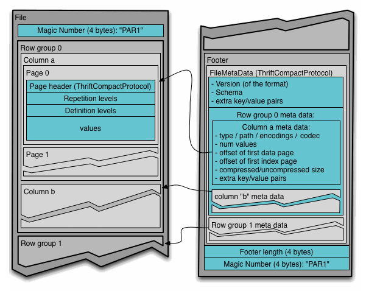
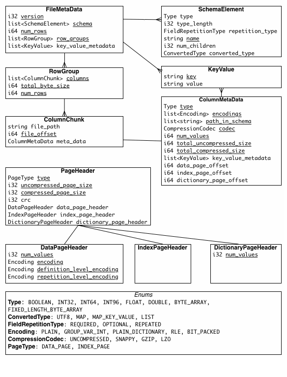

- 官网: https://parquet.apache.org/
- 存储格式
  collapsed:: true
	- ```
	  4-byte magic number "PAR1"
	  <Column 1 Chunk 1 + Column Metadata>
	  <Column 2 Chunk 1 + Column Metadata>
	  ...
	  <Column N Chunk 1 + Column Metadata>
	  <Column 1 Chunk 2 + Column Metadata>
	  <Column 2 Chunk 2 + Column Metadata>
	  ...
	  <Column N Chunk 2 + Column Metadata>
	  ...
	  <Column 1 Chunk M + Column Metadata>
	  <Column 2 Chunk M + Column Metadata>
	  ...
	  <Column N Chunk M + Column Metadata>
	  File Metadata
	  4-byte length in bytes of file metadata
	  4-byte magic number "PAR1"
	  ```
	- 
	- 
- 体感上来讲跟 [[CarbonData]] 的差异在于在文件的最后追加 metadata
	- 好处是可以做流式写入
		- 这个 meta 还可以用存储 min/max，用来支持在读取的时候跳过一些 chunk
	- 缺点是对 non-seek 存储不友好，比如说 [[对象存储]]。
- 将 [[CSV]] 转化为 [[Parquet]] 可以
	- `pip install pandas pyarrow fastparquet`
	- ```python
	  import pandas as pd
	  df = pd.read_csv('data.csv')
	  df.to_parquet('data.parquet')
	  ```
- 相比于 CSV，parqeut 的数据压缩率真的很高
	- 同样是一个月的 OnTime 数据，csv 有 100+ MB，parquet 只需要 11MB
	- 根据实际的测试，把 [[csv]] 压缩成 [[zstd]] 也能取得类似的压缩率
		- 区别在于 parquet 直接可读，而 csv 需要先解压缩才能读取
-
- 原来 [[S3/Select]] 也支持 Parquet - -
-