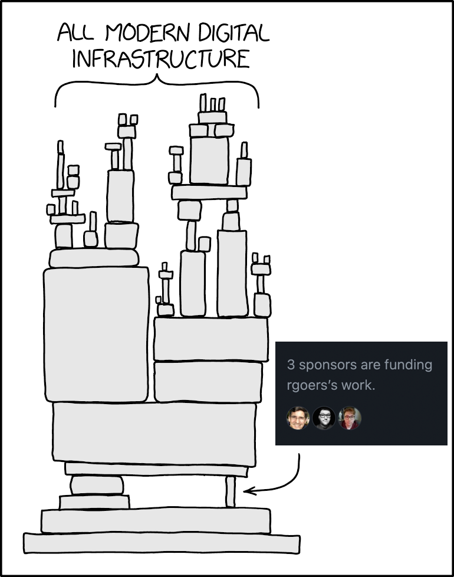

title:: Professional maintainers: a wake-up call
type:: [[Article]]
status:: [[DONE]]
link:: https://blog.filippo.io/professional-maintainers/

- 本文实际上在讨论 [[Sustainability of Open Source Projects]]
- {:height 986, :width 770}
- 本文提到了开源项目维护者的两种模式，但是他们各自有各自的问题：
	- 志愿者
		- 没钱：一个资深的软件开发者年薪大约为 $150k–300k+/year(羡慕死了)，而 Github Sponsor 往往连这个价格的十分之一都不到，能 cover 年薪的开源项目维护者凤毛麟角
		- 没有成长路径：这是一个更严重的问题，开源项目的维护者没法从初级进阶到高级最后变成资深。
	- 公司雇员
		- 全职的开源员工的模式从组织到个人都不太健康，公司会质疑为什么要为你的工作付钱，维护者需要证明自己的工作很重要
			- (Vercel 最近聘用了大量的开源维护者全职维护项目，他们是怎么考虑的呢？)
			- (一个完全开源的公司会不会有不同的视角？)
- 最后本文提出的解决方案是 paying invoices，难听一点的方式是向公司要钱
	- 维护者需要自己成立一家公司，解决一些法务和财务上的问题
	- 然后向公司提交发票，要求公司为自己的工作付费
	- 这样，维护者和公司之间会建立起一个合同(考虑跟多个公司之间的合同)
		- 维护者承诺维护项目，并考虑项目的长期健康发展，以及公司的需求
		- 而公司则得到了一个稳定的项目
- 感想
	- 从成本上来看，公司为维护者付费是更划算的
		- 维护者不是公司正式员工，公司不需要为维护者支付医保社保等
		- 维护者对项目更了解，相比于雇佣全职员工相比收益更高
	- 风险在于
		- 项目不可控
			- 开源项目维护者跟公司出现分歧的话怎么办？
		- 人员不可控
			- 如果维护者不干了怎么办？
			- 更严重一点，维护者直接将项目删除了怎么办？
	- 还有个困难的地方是观念转变，商业公司会接受吗？
		- 其实我从 [[青云]] 离职的时候还真的考虑过这种模式。。