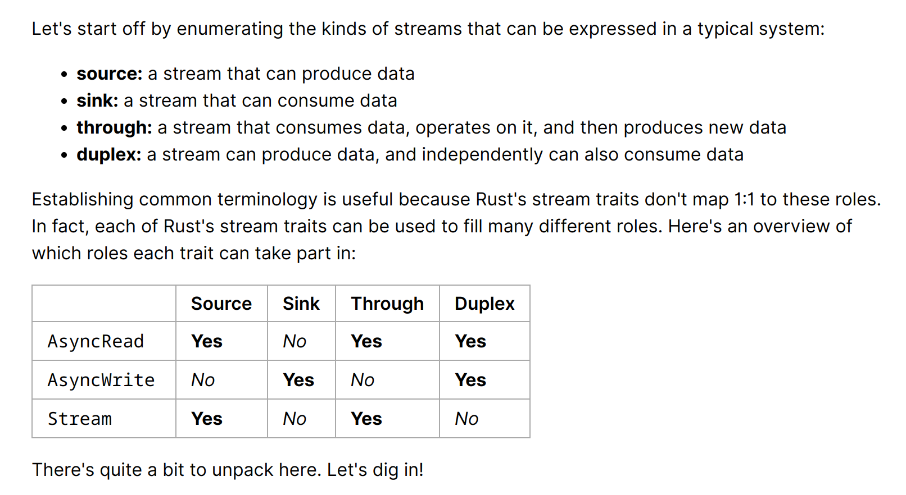

- > In asynchronous Rust the core streaming abstraction is Stream. It behaves very similar to Iterator, but instead of blocking between each item yield, it allows other tasks to run while it waits.
- 
-
- 参考资料
	- [Rust Streams](https://blog.yoshuawuyts.com/rust-streams/)