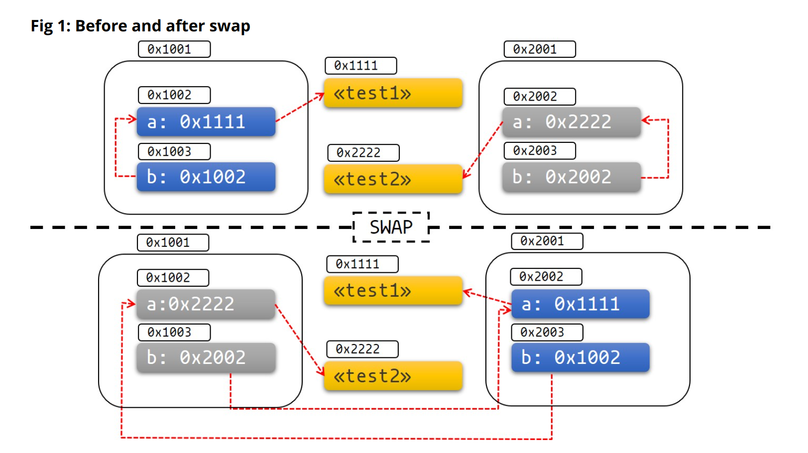

- Rust 中的大部分类型都可以安全的 move，标准库默认为他们实现了 `Unpin`，只有一种情况例外：自引用类型。
- 最常见的自引用类型是实现了 [[Rust/std Future]] 的对象
	- ```rust
	  pub trait Future {
	      type Output;
	      fn poll(self: Pin<&mut Self>, cx: &mut Context<'_>) -> Poll<Self::Output>;
	  }
	  ```
-
- Pin 是什么？
	- > Pin exists to solve a very specific problem: self-referential datatypes, i.e. data structures which have pointers into themselves.
	- Pin 是一个智能指针类型，确保被它包裹的指针指向的数据不会被 move
		- 比如说 `Pin<&mut T>`, `Pin<&T>`, `Pin<Box<T>>` 都保证了 `T: !Unpin` 不会被 move
-
- 为什么需要 Pin ？
	- ```rust
	  #[derive(Debug)]
	  struct Test {
	      a: String,
	      b: *const String,
	  }
	  
	  impl Test {
	      fn new(txt: &str) -> Self {
	          Test {
	              a: String::from(txt),
	              b: std::ptr::null(),
	          }
	      }
	  
	      fn init(&mut self) {
	          let self_ref: *const String = &self.a;
	          self.b = self_ref;
	      }
	  
	      fn a(&self) -> &str {
	          &self.a
	      }
	  
	      fn b(&self) -> &String {
	          assert!(!self.b.is_null(), "Test::b called without Test::init being called first");
	          unsafe { &*(self.b) }
	      }
	  }
	  
	  ```
	- 在这个例子当中，`self.b` 指向了 `self.a`。当 Test 发生 move 时，self.b 还在指向原先的地址：
	- 
	- 当然，创建自引用类型本就是 unsafe 操作，开发者和使用者有必要详细的记录内存行为，开发者有权要求使用者在 move 之后手动更新 `self.b` 的地址。但是这太不好用了，而且非常容易出问题。
	- 于是 `Pin` 诞生了，它的作用是保证指针类型背后的值不会被 move。编译器会在编译期对 `Pin<T>` 做检查，如果发生了 move，就会给出一个编译错误，从而强迫开发者写出正确的代码。
-
- 常用的技巧
	- `Box::pin()`
		- 将数据 pin 在堆上
	- `futures::pin_mut`
		- 将数据 pin 在栈上
		- ```rust
		  #[macro_export]
		  macro_rules! pin_mut {
		      ($($x:ident),* $(,)?) => { $(
		          // Move the value to ensure that it is owned
		          let mut $x = $x;
		          // Shadow the original binding so that it can't be directly accessed
		          // ever again.
		          #[allow(unused_mut)]
		          let mut $x = unsafe {
		              $crate::core_reexport::pin::Pin::new_unchecked(&mut $x)
		          };
		      )* }
		  }
		  ```
-
- 关于 Pin 的黄金八条 (来自 Rust Async Book，简要翻译如下)
	- 如果 `T: Unpin` (默认行为)，那么 `Pin<'a, T>` 完全等价于 `&'a mut T`。
		- 换句话说，`Unpin` 意味着 T 就算被 pin 住了也能 move，所以 Pin 对 T 完全没有作用。
	- 如果 `T: !Unpin`，pin 住的对象获取 `&mut T` 是 unsafe 行为
	- 大多数标准库中的类型都实现了 `Unpin`。
		- 跟你们在 Rust 中遇到的 “正常” 类型一样。
		- 由 `async/await` 自动生成 Future 是这个规则的例外。
	- 在 nightly 版本中，通过开启指定的 feature flag 可以为类型增加 `!Unpin`
		- 或者在 stable 版本中使用 `std::marker::PhantomPinned`
	- 可以 Pin 在栈上，也可以 pin 在堆上
	- 将 `!Unpin` 对象 pin 在栈上需要 unsafe
	- 将 `!Unpin` 对象 pin 在堆上不需要 unsafe： `Box::pin`
	- 对被 Pin 住的 `T: !Unpin` 数据，从被 pin 住的那一刻直到 `Drop` 被调用，必须要保证它的内存不会无效或者重新使用
		- 这是 pin 语义最重要的部分
- 参考资料
	- [Rust Async Book: Pinning](https://rust-lang.github.io/async-book/04_pinning/01_chapter.html)
	- [Pin, Unpin, and why Rust needs them](https://blog.cloudflare.com/pin-and-unpin-in-rust/)
	- [Rust 的 Pin 与 Unpin](https://folyd.com/blog/rust-pin-unpin/)  *通俗易懂，推荐！*
	- [Without boats: pinning 相关文章](https://without.boats/tags/pinning/)