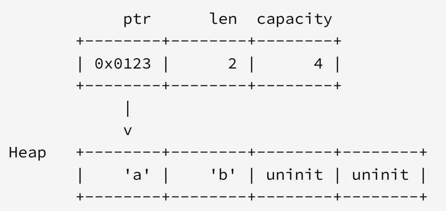

title:: Rust/std io Read

- https://doc.rust-lang.org/std/io/trait.Read.html
-
- caller 需要注意
	- 正常的时候会返回 `Ok(n)`
	- n > 0 的时候表示读取到了 n bytes 的数据，但是 n 不一定保证会填满 buf，即使是在有足够数据的时候
	- n == 0 的时候会有两种情况
		- 所有数据读完了，即 EoF
		- 传入的 buf len 小于 0
- 为什么会这样实现呢？
	- 首先看语义
		- 一个 `&mut [u8]` 的 len 表示它实际拥有的元素，而 cap 表示它未来还能增加而无需进行分配的可用空间。
		- 他们的内存布局是这样的
			- {:height 330, :width 680}
		- 需要明白的是，你能用这么多并不代表你真的拥有这么多
	- 然后看行为
		- 想象一下，如果 read 真的使用 cap 不是 len 会发生什么
		- 用户传入了一个 len=0, cap=10 的 buf 进来，我们写入了 5 bytes 数据
		- 此时用户是不能直接操作 buf[..5] 的，因为 read 并不能更新这个 buf 的 len
		- 这为用户增加了更多的负担
	- 隔壁 [[Golang]] 也有类似的考虑
		- [Why the standard library bufio.Read(p []byte) (int, err) checks len(p) instead of cap(p) in Go](https://stackoverflow.com/questions/63095490/why-the-standard-library-bufio-readp-byte-int-err-checks-lenp-instead-o)
		-