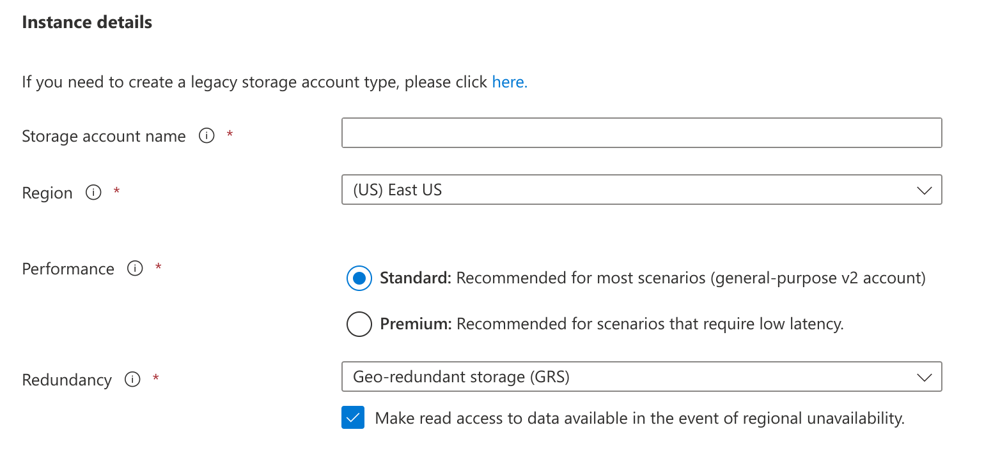
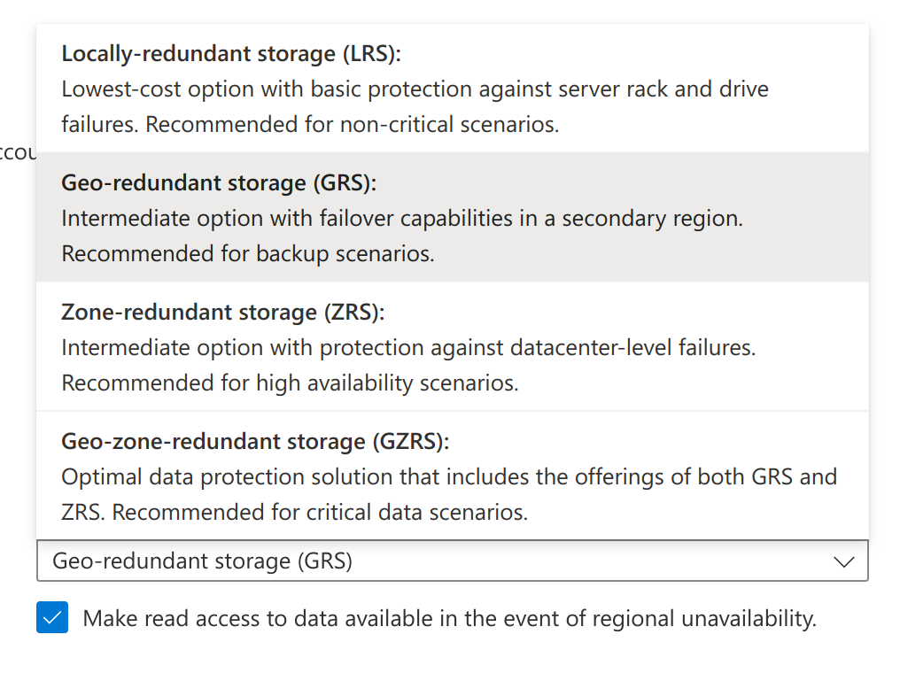

title:: Windows Azure Storage: A Highly Available Cloud Storage Service with Strong Consistency
type:: [[Paper]]
conference:: [[SOSP '11]]
doi:: [10.1145/2043556.2043571](https://dl.acm.org/doi/10.1145/2043556.2043571)

- https://sigops.org/s/conferences/sosp/2011/current/2011-Cascais/printable/11-calder.pdf
-
- [[Azure Blobs]]，[[Azure Disks]], [[Azure Files]] 等存储服务都是基于同一套架构搭建的
- 除了传统的存储服务之外，这套架构还支持了
	- [[Azure Queues]]
	- [[Azure Tables]]
-
- 先进，非常先进。
- ---
- 关键特性
	- 强一致
	- 全局可共享的命名空间
	- 灾难恢复
	- 多租户和存储成本
		- WAS 对存储成本的理解是比用户在自有硬件上承载相同的负载要更低
- Global Partitioned Namespace
	- WAS 采用全球统一的命名规则
	- `http(s)://AccountName.<service>.core.windows.net/PartitionName/ObjectName`
	- 其中
		- service 指 WAS 提供的各项存储服务，包括 `blob`，`table` 和 `queue`
		- AccountName 是用户的帐户名
		- PartitionName 是一组资源的集合
			- 对应到 [[S3]] 的话，PartitionName 就是 Bucket Name
			- 对 Table 来说就是一张表，对 Queue 来说就是一个队列
			- 现在 [[Azure Storage]] 应该是叫做 Container 了
		- ObjectName 是就是一个特定资源的 Key 的
			- 对应到 [[S3]]，可以叫做 Object Key
	- 跟传统的 [[S3]] 设计是不一样的
		- 一般的 S3 设计不会在全局的路由中加上帐户名
		- Bucket Name 就是全局共享的
		- 国内厂商的话，有 [[COS]] 采用了类似的设计
		- 按照 Paper 中的说法，AccountName 会用来定位主存储集群和数据存储的数据中心
		- 从商业上考虑，云供应商可以为不同的 AccountName 提供不同的服务级别
		- 从实际的体验上来看，AccountName 会跟性能的指标和数据的可用性级别相关
		- 以现在的一个实际创建流程截图为例
			- 
		- Redundancy 的可选项列表
			- 
		- 这个 Account 下的所有资源都会共享相同的配置
	- 突然想到这个设计的一个妙处，这里展开说一下
		- 大多数对象存储系统受到 S3 影响比较大，我们把数据冗余度和数据访问频次混合在了一起，通过 [[存储级别]] 来配置
		- 比如说
			- Standard：标准存储
			- Standard_IA： 低频存储
			- Archive: 归档存储
		-
- ---
- 无用但有趣的一些小发现
	- WAS 很容易手滑打成 AWS (
		- 后来 WAS 把前面的 windows 去掉了，只说 Azure Storage
		- 肯定跟这个没关系 (