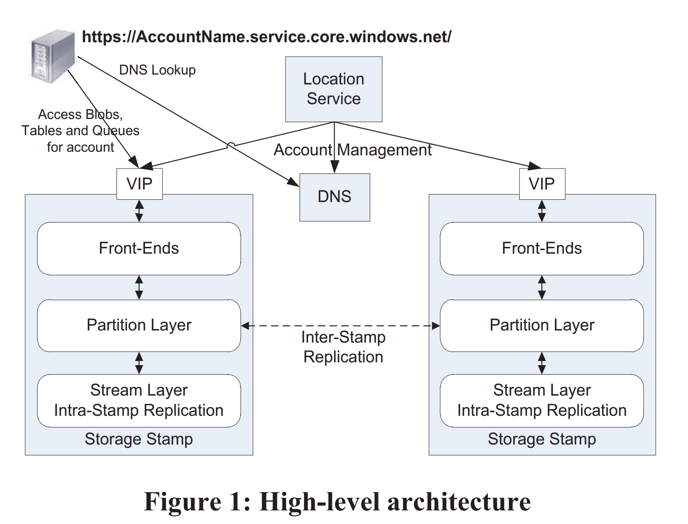
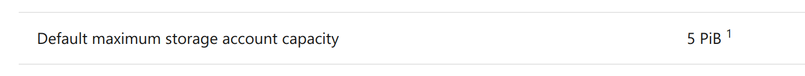
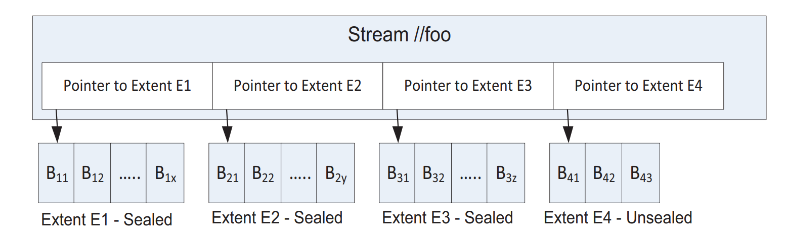
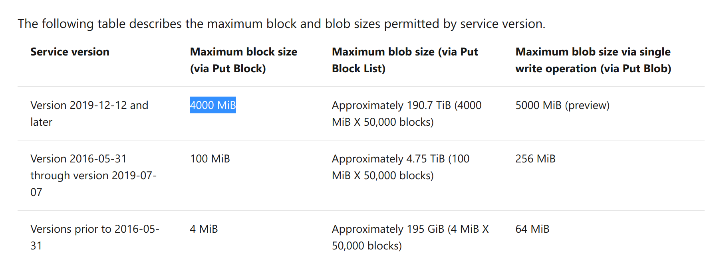
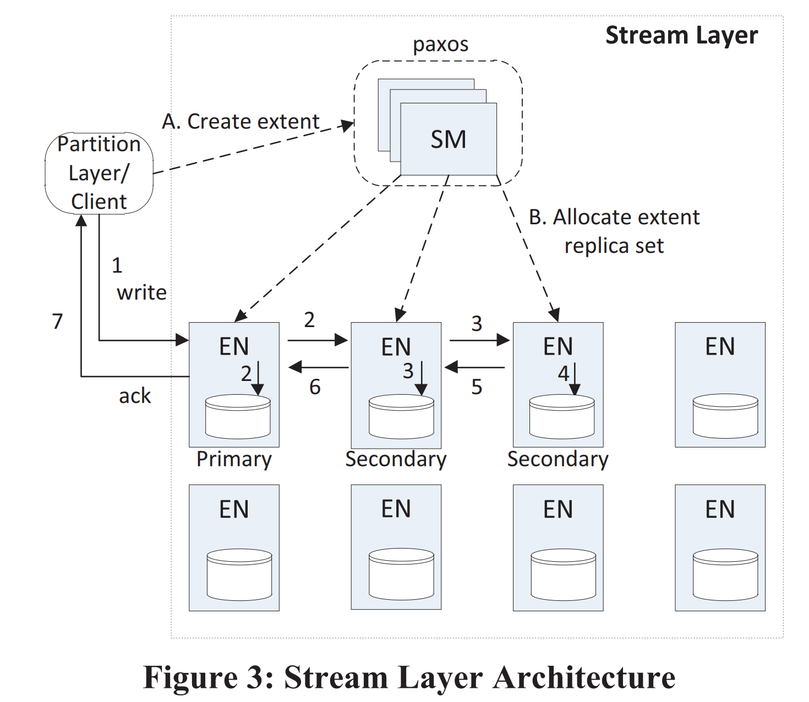

title:: Windows Azure Storage: A Highly Available Cloud Storage Service with Strong Consistency
type:: [[Paper]]
conference:: [[SOSP '11]]
doi:: [10.1145/2043556.2043571](https://dl.acm.org/doi/10.1145/2043556.2043571)

- 论文链接
	- [SIGOPS](https://sigops.org/s/conferences/sosp/2011/current/2011-Cascais/printable/11-calder.pdf)
	- [IPFS](https://cloudflare-ipfs.com/ipfs/bafybeieewxuxmbvkn2xhkpxczsgkhk5phs24fd25rtunnq43w4oeikl4ky)
-
- [[Azure Blobs]]，[[Azure Disks]], [[Azure Files]] 等存储服务都是基于同一套架构搭建的
- 除了传统的存储服务之外，这套架构还支持了
	- [[Azure Queues]]
	- [[Azure Tables]]
-
- 先进，非常先进。
- ---
- 关键特性
	- 强一致
	- 全局可共享的命名空间
	- 灾难恢复
	- 多租户和存储成本
		- WAS 对存储成本的理解是比用户在自有硬件上承载相同的负载要更低
- Global Partitioned Namespace
	- WAS 采用全球统一的命名规则
	- `http(s)://AccountName.<service>.core.windows.net/PartitionName/ObjectName`
	- 其中
		- service 指 WAS 提供的各项存储服务，包括 `blob`，`table` 和 `queue`
		- AccountName 是用户的帐户名
		- PartitionName 是一组资源的集合
			- 对应到 [[S3]] 的话，PartitionName 就是 Bucket Name
			- 对 Table 来说就是一张表，对 Queue 来说就是一个队列
			- 现在 [[Azure Storage]] 应该是叫做 Container 了
		- ObjectName 是就是一个特定资源的 Key 的
			- 对应到 [[S3]]，可以叫做 Object Key
	- 跟传统的 [[S3]] 设计是不一样的
		- 一般的 S3 设计不会在全局的路由中加上帐户名
		- Bucket Name 就是全局共享的
		- 国内厂商的话，有 [[COS]] 采用了类似的设计
		- 按照 Paper 中的说法，AccountName 会用来定位主存储集群和数据存储的数据中心
		- 从商业上考虑，云供应商可以为不同的 AccountName 提供不同的服务级别
		- 从实际的体验上来看，AccountName 会跟性能的指标和数据的可用性级别相关
		- 以现在的一个实际创建流程截图为例
			- 
		- Redundancy 的可选项列表
			- 
		- 这个 Account 下的所有资源都会共享相同的配置
	- 突然想到这个设计的一个妙处，这里展开说一下
		- 大多数对象存储系统受到 S3 影响比较大，我们把数据冗余度和数据访问频次混合在了一起，通过 [[存储级别]] 来配置
		- 比如说
			- Standard：标准存储
			- Standard_IA： 低频存储
			- Archive: 归档存储
			- One Zone-IA: 其他的存储级别会在至少三个 AZ 中存储一份，这个存储级别只存储一份，价格会便宜 20%
		- 具体到实现上，大家可能会用三副本来实现 Standard，用
		- 但是 WAS 这里就把这两个维度拆开了，变成了正交的关系
			- Account 级别配置 Redundancy
			- Blobs 级别可以配置 Access Tier
		- 感觉非常的优雅而合理
- High Level Architecture
	- 
	- Storage Stamps
		- 每个 Storage Stamps 是由 N 个机柜组成的集群
		- 每个机柜是一个独立的故障域，有冗余的网络和供电
		- 一般来说每个集群有 10 - 20 个机柜
		- 每个机柜内有 18 个存储节点
		- 每个集群可提供 2PB 左右的原始存储空间
			- 注意这是在 2011 年，硬盘容量普遍是 1 TB
				- *那一年泰国洪水，让机械硬盘大涨价*
			- 现在主流服务器硬盘的大小已经是 8TB/10TB 了，行业内正在突破单盘 20 TB
		- 论文里面还提到空间利用率的问题
			- 为了容量，事务和带宽中取得平衡，WAS 会尽量保证空间利用率在 70% 左右
			- 会尽量避免利用率超过 80%，因为要预留 20% 的空间来防止寻道时间过长和灾备
			- 当空间超过 70% 的时候就会主动触发迁移，将 accounts 迁移到别的 stamp
			- #question 如果单个 Account 存储的数据超过 Stamp 怎么办？
				- 凉拌，看起来设计上就不允许超过
				- [文档](https://docs.microsoft.com/en-us/azure/storage/common/scalability-targets-standard-account) 给出了每个 storage account 的最大配额
					- 
				- 注意这是整个 storage account 共用的
				- 不过 Azure 在文档页高亮了提示，如果超过配额可以找客服申请
					- 我推测应该是会存在更大的 Stamp，可以将这个 Account 迁移过去
	- Location Service (LS)
		- **The location service manages all the storage stamps.**
		- LS 会负责所有 Storage Stamps 的管理，将 Account 映射到 Storage Stamps，处理 Account 在 Stamps 之间的迁移
		- 它本身会在两个地理位置不同的数据中心部署用来做灾备
		- LS 会支持增加新的 Region，新的 Location (感觉上是 AZ 的意思) 和新的 Stamps
		- 论文中给出了一个典型的 Account 创建流程
			- App 请求创建一个新的 Account，请求中会携带指定的 Location
			- LS 会在指定的 Location 选择一个 Stamp 作为该帐号的主 Stamp
				- 选择的算法中会基于所有 Stamp 的负载信息做一些启发式分析
				- 比如说 Stamp 的存储负载，流量和事务的频次
			- 然后 LS 会在这个 Stamp 中存储 Account 相关的 Metadata 信息以通知 Stamp 开始处理这个 Account 的流量
			- 最后 LS 会更新 DNS，将 `http(s)://AccountName.<service>.core.windows.net/` 的解析目标修改为主 Stamp 的 VIP
	- Three Layers within a Storage Stamp
		- Stream Layer
			- **This layer stores the bits on disk and is in charge of distributing and replicating the data across many servers to keep data durable within a storage stamp. **
			- 实际上可以理解为一个跨节点的大号 SSD
			- 它负责对外提供 Stream 的抽象
				- Stream 是由 Extents 组成的有序列表，Extents 表示一组连续的数据 Chunk
				- 处理如何存储，如何复制等问题，不理解上层的抽象和语义
				- 只负责写，读取请求由上层的 Partition Layer 处理
		- Partition Layer
			- 主要功能包括
				- 管理和理解上层业务抽象：Blob，Table，Queue
				- 提供 Object Namespace
				- 为 Object 保证事务顺序和强一致性
				- 在 Stream Layer 之上存储数据
				- 缓存
			- 此外还会提供一些基于 PartitionName 的负载均衡
		- Front-End (FE) layer
			- 一组无状态服务
			- 请求进来的时候完成认证，然后路由到对应的 Partition Server
			- 系统会维护一组 Partion Map，然后 FE 会 cache 这个 map 来提供转发的功能
			- 论文还提到 FE 会从 Stream Layer 直接提供大对象并缓存一些经常访问的数据
				- #question 这个有点奇怪，按照目前的设计，FE 还需要直接从 Stream 读取数据吗？
	- Two Replication Engines
		- Intra-Stamp Replication (stream layer)
			- stream layer 内部的同步 Replication 在 Write IO 的核心路径上
			- Block 粒度(每一笔 IO)
			- 应该是每次写入的时候会写入位于不同节点的多个副本
			- 只有 replication 同步成功，写入请求才会返回成功
		- Inter-Stamp Replication (partition layer)
			- 跨 Stamp 的异步 Replication 不在 IO 核心路径上
			- Object 粒度 (包括跟这个 Object 相关的事务)
			- 用来提供
				- 用户的数据冗余，作为灾备
				- 前面提到的跨 Stamp 迁移 Account
		- Why two ways？
			- 他们针对的是不同场景
			- Intra-Stamp Replication 想处理的是硬件故障
			- 而 Inter-Stamp Replication 想处理的是整个机房挂掉的场景
			- 前者在用户的核心 IO 路径上，所以延迟要求很高；而后者不在，所以只要速度能接受就行
- Stream Layer
	- *重头戏登场*
	- The stream layer provides an internal interface used only by the partition layer.
	- Stream 提供一个类似于 file system 的 API，只不过所有的写入都是 Append Only 的
		- 它支持客户端 open，close，delete，rename，read，append 和 concat
	- 一个 Stream 是一个由 Extent 组成的有序列表，而 Extent 是一组连续的 Append Block
	- 
	- 注意这里的 `Sealed`
		- Sealed Extent 就不能再 Append 新数据了，只有最后一个 Unsealed Extent E4 可以追加新数据
		- 论文明确指出 Stream 只有最后一个 Extent appendable，之前的 Extent 都是 immutable 的
	- Block
		- 读写的最小单元，最大 4MB
		- Client 可以不断的向 Extent 追加不同 size 的 Block
		- 读取数据的时候，不管读多少，整个 block 的内容都会被读取
			- WAS 在 block level 存储一个 checksum，每次读取的时候会校验数据是否正确，防止静默错误
			- 除此以外，整个系统之后每个 block 每隔几天就会被重新校验一下
		- 这个概念实际上是暴露到用户侧的
			- azblob 的用户上传大文件的时候就需要连续上传最大 4MB 的 block
			- 然后最后调用 Put Block List 接口来 commit
			- 最新的版本中将这个限制放开到了 4000 MiB，推测内部的实现应该改了
			- 
	- Extent
		- 复制的最小单元，默认的配置是三副本
			- #question 前面提到 Intra-Stamp Replication 是 Block 粒度的备份，跟这里的描述似乎有些冲突
				- 前文的原话是
					- > intra-stamp replication is focused on replicating blocks of disk storage that are used to make up the objects.
					- 感觉这里的 Block 应该在指代不同的东西
					- `blocks of disk storage` 指磁盘上连续的 block，也就是 Extent，并非上面提到的 Block
		- 每个 Extent 都是一个 [[NTFS]]  文件，包含一组连续的 Block
		- 小文件优化
			- Partiton Layer 会将小文件 append 进同一个 extent 甚至是同一个 block
		- 大文件优化 (Blobs)
			- Partition Layer 会将大文件拆分成不同的 extent
		- Partition Layer 会跟踪每个 Object 由哪个 Stream，Extent 及其 Offset 组成
	- Stream
		- Stream 是一组 Extent **指针** 的有序列表，支持追加写最后一个 extent 和随机读
		- 从已有的 Stream 中的部分内容构造出一个新 Stream 是一个开销很小的操作
			- 因为只需要更新一组指针
			- 这个特性能用于优化 Copy 相关的操作
				- #idea 难怪 [[azblob]] 支持 [Put Blob List](https://docs.microsoft.com/en-us/rest/api/storageservices/put-block-list) 这种操作
					- 先进啊，太先进了
			- 此外灾备的时候也很有用处
		- 只有最后一个 Extent 可写(append)，前面的 Extent 都是 immutable 的
	- Stream Manager and Extent Nodes
		- 接下来看看组成 Stream Layer 的组件
		- 
		- Stream Manager (SM)
			- The SM keeps track of the stream namespace, what extents are in each stream, and the extent allocation across the Extent Nodes (EN).
			- SM 本身是一个 [[Paxos]] 集群，不在读写的关键路径上
			- SM 主要负责的任务
				-
- ---
- 无用但有趣的一些小发现
	- WAS 很容易手滑打成 AWS (
		- 后来 WAS 把前面的 windows 去掉了，只说 Azure Storage
		- 肯定跟这个没关系 (
- [[2022-01-14]] 感想
	- 有种逐渐理解了一切的感觉， [[azblob]] 之前有些奇怪的设计都有了合理的解释