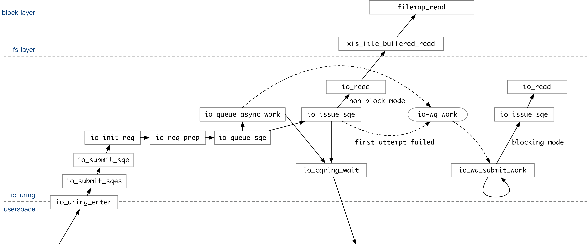

- published version: https://xuanwo.io/2021/06-storage-system-from-interface/
-
- 从本质上说，计算机系统实际上就是由三个系统组成的：一个是计算系统，另一个是存储系统，最后是网络系统。但是他们并不是孤立存在的，比如说一个纯粹的计算系统没有任何价值——计算的结果无法保存也无法传递给他人。
	- > 这一段是不是没有必要说啊，感觉可以放在 [[Storage]] 介绍里面
- 今天从数据操作接口的角度聊聊各种各样的持久化存储服务，我根据数据的定位方式将这些服务分为以下几类：
	- Block Storage / 块存储：基于块的 Offset 定位
	- File Storage / 文件存储：基于文件的 Path 定位
	- Object Storage / 对象存储：基于对象的 Key 定位
	- Content Hash Storage / 内存哈希存储：基于内容的 Hash 定位
	- Key-Value Storage / 键值存储：基于 Key 定位 (看起来没有这样的 API，考虑)
	- 持久化内存？
		- persistent memory / Optane / [[NVM]]
		- 接口是什么样的？
		- byte addressing
- 更广泛的来说，数据库，不管是 SQL / NoSQL / NewSQL 本质上也是存储系统中的一种，人们通过特定的语法来获取其中的数据。比如 Redis 可以看作是一个根据 Key 定位的存储服务，而 MySQL 可以看作根据 Table Index 定位的存储服务。我对数据库了解不是很多，就不展开详细聊了。
- 在开始介绍之前，我首先要纠正一个常见的误区。很多同学经常觉得存储系统中存在着这样的递进关系：块存储 -> 文件存储 -> 对象存储。这确实是一种比较常见的架构，但并不总是如此。balabala
- Block Storage
	- 块存储对外暴露的接口
		- Page -> Segment -> Block -> Sector
		- Sector: Smallest addressable unit, defined by the device (power of 2, usually 512 bytes)
		- Page: Fixed-length block of main memory that is contiguous in both physical and virtual memory addressing. Smallest unit of data for memory allocation performed by the OS.
		- Block: Smallest addressable unit, defined by the OS (power of 2, at least sector size, at most page size)
		- Buffer: Represents a disk block in memory
		- Buffer head: struct that describes a buffer
		- bio struct
			- https://git.kernel.org/pub/scm/linux/kernel/git/torvalds/linux.git/tree/include/linux/blk_types.h?h=v5.12#n223
		- A bio identifies a target device, an offset in the linear address space of the device, a request (typically READ or WRITE), a size, and some memory where data will be copied to or from.
		- bio_vec
			- https://git.kernel.org/pub/scm/linux/kernel/git/torvalds/linux.git/tree/include/linux/bvec.h?h=v5.12
	- DAS / SAN (SCSI) / NVMe
		- 简单介绍一些这些物理接口？
		-
	- AIO / io_uring 这些跟 BIO 是什么关系呢？
		- 
- File Storage
	- [[ext4]] / [[btrfs]] / [[zfs]]
	- POSIX 文件系统语义
	- 文件系统，根据 Path 定位
	- 内核抽象是 [[VFS]]
	- dio / aio / [[io_uring]]
	- Windows API [fileapi.h header](https://docs.microsoft.com/en-us/windows/win32/api/fileapi/)
- Object Storage
	- [[s3]] / [[minio]] / [[ceph]]
	- object based API
	- PutObject / GetObject
	- [[RADOS]]
- Byte Storage？
	- [[Intel Data-Centric Innovation Day的启示(2)-Intel AEP]]
	- http://lightnvm.io/
- Content Hash Storage
	- [[IPFS]]
- 参考资料
	- [An Introduction to Linux Block I/O](https://researcher.watson.ibm.com/researcher/files/il-AVISHAY/01-block_io-v1.3.pdf)
	- A block layer introduction part 1: the bio layer
		- https://lwn.net/Articles/736534/
	- Linux Storage Stack Diagram
		- https://www.thomas-krenn.com/en/wiki/Linux_Storage_Stack_Diagram
		- https://www.thomas-krenn.com/de/wikiDE/images/7/72/Linux-storage-stack-diagram_v4.10.svg